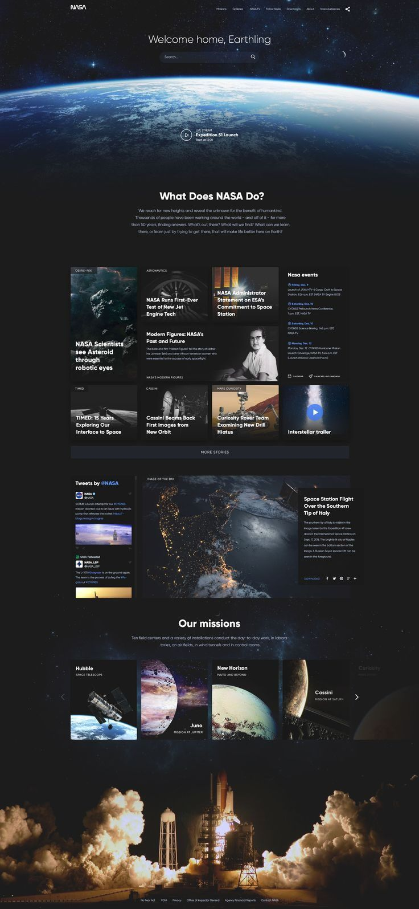
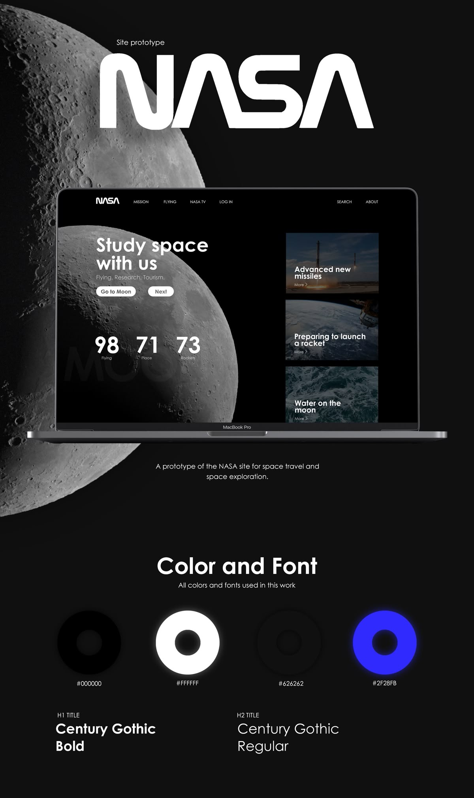
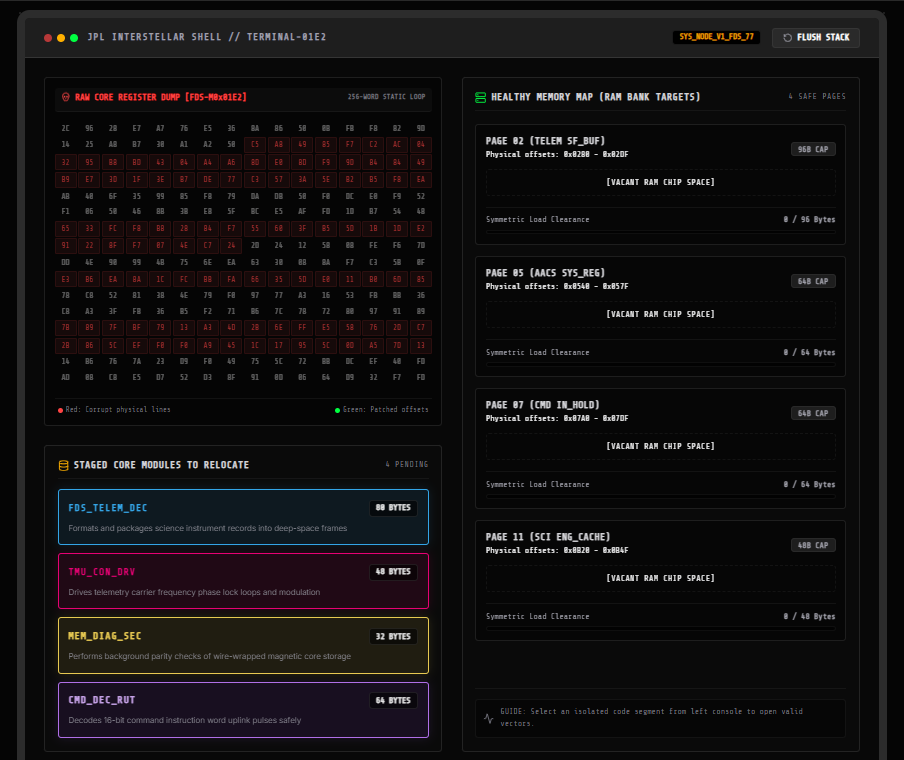

# CSARCH2 Virtual Exhibit Proposal

## S03 Group 3

## Group Members

| Name |
| :--- |
| Gonzaga, Rainer D. |
| Gonzales, Aaron James S. |
| Manalang, Kennese Ross F. |
| Marcaida, Duncan Joseph B. |
| Ramos, Richmond Jose G. |

---

## I. Topic Theme

**Project Title:** Memory Block Blast: Reallocating Voyager 1’s Fragmented Memory Map  
**Chosen Topic:** The 2024 Voyager 1 Flight Data Subsystem (FDS) Memory Rescue  
**Category:** Problem-solving stories

---

## II. Exhibit Narrative Content

### 1. What is Voyager 1?

Launched on September 5, Voyager 1 is one of the two space probes launched by NASA in 1977. It holds the record for traveling further than any man-made object originating from Earth. It is currently drifting through interstellar space at a speed of around 17 kilometers per second, over 15 billion miles from Earth. It operates on legacy computer architecture built during the 1970s, acting as a sort of time capsule of early computing. Because of the distance, any radio command sent to the space probe takes around 23.5 hours to arrive, making a full communication round-trip take 47 hours.

### 2. Background/Context of Voyager 1 FDS Failure

In November 2023, the Telemetry Modulation Unit (TMU) of Voyager 1 suddenly stopped sending readable data, instead transmitting a gibberish pattern of binary 1s and 0s. After months of remote debugging, NASA pinpointed the root cause: a corrupted 256-word memory chip inside the Flight Data Subsystem (FDS). Since physical repair is impossible to do, the spacecraft's operating code on that faulty chip had to be relocated to a different memory.

### 3. Why This is a Computer Architecture Topic (Problem & Solution)

This situation is a real-world example of hardware constraints and memory mapping. It highlights how software instructions are permanently tied to physical memory addresses. Working with highly restricted 1970s memory banks, NASA engineers had to calculate the exact byte sizes of the stranded instructions and chop the code into smaller fragments. From there, they meticulously rewrote the internal memory pointers so the CPU could pull and execute these scattered pieces of code across different, non-contiguous hardware blocks.

### 4. Timeline of the mission

* **September 5, 1977** - Launch of Voyager 1
* **November 14, 2023** - Voyager 1 stopped sending readable science and engineering data back to Earth
* **March 3, 2024** - NASA team noticed that activity from one part of the flight data system stood out from the rest of the garbled data.
* **April 20, 2024** - Mission flight team heard back from the spacecraft after five months.

---

## III. Exhibit Flow

### Narrative Structure

The exhibit follows a **ScrollyTelling** format. As the user scrolls downward, the chronological timeline of Voyager 1 unfolds through scroll-driven animations and visual storytelling elements, simulating a sense of space travel that mirrors the spacecraft’s journey through space.

### Definition of Memory

To give the users a quick foundation before diving into the problem of Voyager 1, this section defines computer memory in accessible terms. It will explain memory as the electronic workspace where a computer stores the active data and operating instructions it needs to function. 

### Memory Addressing and Memory Mapping

Building on the definition of memory, this section introduces how the computer navigates its storage.

* **Memory Addressing:** We will explain how every piece of data is assigned a unique numerical identifier (an address) so the central processing unit (CPU) can locate it instantly.
* **Memory Mapping:** The exhibit will visually break down how a computer organizes these addresses into distinct regions for system code, temporary data, and hardware communications.

Before reaching the interactive segment, users will encounter a brief concept discussion introducing the computer architecture principles behind the Voyager 1 recovery effort. Through descriptions and visual illustrations, the exhibit will explain how software instructions are stored in specific memory locations and how processors use memory addresses to fetch and execute instructions. The discussion will also highlight the challenges posed by hardware limitations and memory corruption, demonstrating how NASA engineers were forced to relocate critical code to alternative memory regions.

### Instruction Pointer Control

The exhibit will also introduce the concept of Instruction Pointer control and program flow. Users will learn how a processor normally executes instructions sequentially and how jump instructions can redirect execution to different memory addresses. This concept is central to understanding how Voyager 1 continued operating even after portions of its software were relocated across non-contiguous memory regions.

### Interactive Element

The interactive mini-game will serve as a visual demonstration of these concepts by allowing users to perform memory reallocation and instruction remapping. Through this activity, users will gain an understanding of how memory organization, address mapping, and control flow were used by NASA engineers to restore communication with Voyager 1 after the Flight Data Subsystem failure.

Upon reaching the 2024 problem-solving segment, the exhibit will feature an interactive mini-game. Voyager 1’s minigame will be focused on memory reallocation and instruction mapping.

* **User Flow:** The user will encounter a mission-control terminal responsible for receiving engineering updates from Voyager 1. Due to a memory chip failure, memory in the FDS that is responsible for packaging and sending engineering and science data became corrupted. They must transfer packages of code from the old memory chip to the new working memory chip by selecting memory chunks from the old memory chip and selecting a sector in the new memory chip for the memory chunk to transfer to. The user must successfully transfer all necessary code to the new memory chip and initiate CPU Jump Remapping to fix Voyager 1’s output stream.

This gamified task serves as an application of the previously discussed Computer Architecture concepts. By relocating code fragments and performing CPU jump remapping, users will gain an intuitive understanding of how software can continue functioning even when code must be relocated across different memory regions. The activity reinforces concepts such as memory addressing, memory organization, and control flow in an engaging medium.

---

## IV. Technical Stack

To build this interactive exhibit, our group will utilize a modern web stack with the following technologies:

* **Astro 6 & Node.js 26:** This is based on the template repository that will be forked.
* **MDX (Markdown Extended):** This lets us write out the historical Voyager story in standard markdown while allowing us to drop our interactive React components straight into the text wherever we need them. 
* **React & TypeScript:** This will be the main stack that will run the interactive minigame. React will be used to manage all the moving parts of the memory block in the minigame. While TypeScript is used to ensure strict data typing for the whole project.
* **Tailwind CSS:** Tailwind CSS will handle the styling for the whole project. It provides utility classes to efficiently style the retro 1970s NASA aesthetic mixed with vibrant, touch-friendly, and mobile-responsive UI for the gamified tasks.

---

## V. Tentative Style Guide Snapshot & Motif

**Theme:** Retro Space Website  
The visual motif will be a blend of the monochromatic aesthetic of 1970s NASA Mission Control terminals for the narrative sections and the vibrant, flat-design UI of an Among Us task screen for the interactive mini-game.

### Color Palette:

* **Background:** Deep Space Black (#050505) and Dark Slate (#1E1E1E) to create an immersive, void-like backdrop.
* **Primary Text (Narrative):** Ghost White (#F8F8FF) and Light Ash (#D3D3D3) for readability against the dark backgrounds.
* **Accent/Interactive UI:** Alert Red (#E63946) for the corrupted memory block and flashing error messages.

### Typography:

* **Heading Font:** Century Gothic Bold or Space Grotesk for wide, commanding section titles.
* **Body/Terminal Font:** Roboto Mono for memory addresses and raw data streams, paired with Inter for standard paragraph readability.

### Layout & Interface:

* **Content Sections:** A single-column layout centered on the screen, reading like a chronological mission log.
* **Interactive Area:** The memory grid will be inside a rounded container with a thick, gray border, designed to look like a physical "tablet" or "maintenance panel" the user just pulled up.

---

## VI. References & Inspiration

### Site References:

* [Star Wars Eclipse](https://www.starwarseclipse.com/)
* [Solar System Scope](https://www.solarsystemscope.com/)
* [NASA Voyager Timeline](https://science.nasa.gov/mission/voyager/timeline/)
* [CNN: Voyager 1 Communication Fix](https://edition.cnn.com/2024/04/22/world/voyager-1-communication-issue-cause-fix-scn)

### Inspiration:

* [Prototype of the new NASA site #1](https://ph.pinterest.com/pin/422281211192498/)

### Reference Images:

